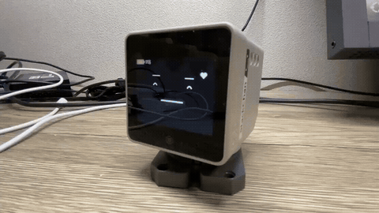

[日本語](README.md)

# StackChan-IDF-for-SanoTTS-jp

Stack-chan firmware that speaks Japanese on an M5Stack CoreS3 — **entirely on the device**,
with no cloud and no companion server. The avatar's mouth moves in time with the synthesised
speech.

This is a fork of [stackchan-idf](https://github.com/ciniml/stackchan-idf) that integrates
[sanoTTS-jp](https://github.com/ayutaz/sanoTTS-jp) (a 559 K parameter distilled model,
22.05 kHz) as a synthesis engine. ESP-IDF 5.5 / C++20.



> The firmware running on hardware ([post by @nnn112358](https://x.com/nnn112358/status/2097082230556467251)).
> A sentence sent to `POST /api/jtts-say` is synthesised on the device and spoken while the
> balloon shows the text.

```
reading (kana, or kanji text on the dictionary build)
   → G2P (kana intermediate form / Open JTalk + dictionary)
   → sanoTTS inference (W8A8 + ESP32-S3 integer SIMD, 176 KB arena)
   → 22.05 kHz PCM played chunk by chunk (synthesis and playback overlap)
   → mouth driven from the playback envelope
```

## What it does

- **Speak by posting a sentence to `POST /api/jtts-say`.** The dictionary build takes
  kanji text as-is
- **Playback starts before synthesis finishes.** The preroll is derived from the previously
  measured real-time factor (xRT)
- **Lip sync** from the amplitude at the current playback position
- **Head motion** via `POST /api/servo-pose`, e.g. a nod before and after an utterance
- Everything upstream still works: AI voice conversation, BLE / Wi-Fi / SoftAP configuration,
  OTA, the Avatar DSL, dance, the LT timer, NeoPixel, four board variants

## Quick start

With ESP-IDF 5.5 installed:

```sh
git clone https://github.com/nnn112358/StackChan-IDF-for-SanoTTS-jp
cd StackChan-IDF-for-SanoTTS-jp
git submodule update --init --recursive
tools/apply-m5-patches.sh                             # small M5Unified fixes

make set-target BOARD=cores3
make build      BOARD=cores3
make flash      BOARD=cores3 PORT=/dev/ttyACM0
```

To read kanji text on the device, use the dictionary profile (see "Build profiles"):

```sh
tools/get-sano-dict.sh                                # fetch the 13.7 MB dictionary (needs gh)
make set-target BOARD=cores3-dict
make build      BOARD=cores3-dict
make flash      BOARD=cores3-dict PORT=/dev/ttyACM0   # ~2.5 min including the dictionary
```

The model weights (654 KB) ship in the repository and are written by `make flash`.
Override the toolchain path with `IDF_PATH=` and the serial port with `PORT=`.

Configure Wi-Fi through the BLE settings page, the SoftAP captive portal, or `tools/ble-cli`.

## Usage

```sh
# Speak (kanji text works on the dictionary build)
curl -X POST --data-binary "今日は良い天気ですね。" http://<device>/api/jtts-say

# Move the head before / after speaking
curl -X POST -d '{"yaw":25,"time_ms":400}'          http://<device>/api/servo-pose
curl -X POST -d '{"yaw":0,"pitch":0,"time_ms":400}' http://<device>/api/servo-pose

# Status
curl http://<device>/api/sano-model    # {"loaded":true,"dict":true,"capacity":655360}
```

### Writing readings

On top of plain kana you can use sanoTTS' intermediate notation:

| Mark | Meaning |
|---|---|
| `[` | pitch accent rise |
| `]` | accent nucleus / fall (jtts' `'` maps to this) |
| `#` | phrase boundary (`、` `。` `/` and spaces map to this) |
| `°` | devoiced vowel |
| `?` `?!` `?.` `?~` | question |

Example: `きょ][おわよ][いて][んきです°ね` = "今日は良い天気ですね".
On the dictionary build, send the kanji text instead and the dictionary decides the reading
and the accent.

### Voice settings

Sent as JSON to `POST /api/jtts-config` (also editable from the settings page):

| Field | Value |
|---|---|
| `engine` | `auto` (default, prefers sanoTTS) / `sano` / `hmm` / `unit` / `formant` |
| `mora_ms` | speaking rate; 110 is unity, larger is slower |
| `gain` | volume, relative to the 0.6 default |

A build-time correction is applied on top (`CONFIG_JTTS_SANO_SPEED_PCT`, default 125 =
durations × 1.25), because the model speaks quickly as trained.

## Build profiles

| | `cores3` (default) | `cores3-dict` |
|---|---|---|
| Input | kana + accent marks | **kana + kanji text** |
| Flash layout | two OTA slots (4 MB each) + 1 MB sano | single 2.19 MiB app + sano + **13.1 MiB dictionary** |
| App size | 3.68 MB (12 % free) | 2.08 MB (9 % free) |
| OTA | yes | no (update over USB) |
| Conversation / audio streaming / camera / ASR / HMM / ESP-NOW | yes | no |
| Japanese fonts | 12 / 16 / 20 / 24 px | 16 px only |

The partition tables are [partitions_16mb.csv](partitions_16mb.csv) and
[partitions_16mb_dict.csv](partitions_16mb_dict.csv). They differ, so **switching profiles
needs a full USB flash**. The dictionary is too large for git; fetch it with
`tools/get-sano-dict.sh`.

## What this fork adds

| Addition | Detail |
|---|---|
| **sanoTTS engine** | `jtts::Engine::Sano`, a fourth engine alongside formant / unit-concatenative / HMM, preferred by `auto`. Output is bit-identical to the upstream reference |
| **Streaming playback** | Synthesis and playback overlap; the preroll comes from the previously measured xRT ([main/sano_stream_player.cpp](main/sano_stream_player.cpp)) |
| **Lip sync** | A 16 ms peak envelope normalised against the loudest window, applied to the mouth every 10 ms from the playback position |
| **On-device kanji G2P** | `BOARD=cores3-dict`: Open JTalk plus a 13.7 MB pruned dictionary supply reading and accent |
| **Speaking-rate correction** | `CONFIG_JTTS_SANO_SPEED_PCT` (default 125 = durations × 1.25), because the model speaks quickly as trained |
| **`POST /api/servo-pose`** | Set the head pose in degrees — the hook for nodding before and after an utterance |
| **`purin` face preset** | Based on aNo-Lab's "[プリンを守る技術](https://github.com/anoken/purin_wo_mamoru_gijutsu/)" ([assets/purin_face.avdsl](assets/purin_face.avdsl)); switch from the settings page or `POST /api/avatar-dsl`, built-in default via `CONFIG_AVATAR_DEFAULT_FACE` |

## What this fork disables

### Disabled in the regular build (`cores3`)

| Disabled | Reason / impact |
|---|---|
| esp-sr model partition 2.9 MB → **1.9 MB** | 1 MB handed over to the sanoTTS weights. The offset is unchanged, so an already-flashed model still works, and one Japanese wake word (`srmodels.bin`, ~290 KB) fits comfortably |
| The 440 Hz boot probe tone | A bring-up beep for the 16 kHz playback path that used to sound on every boot. Off by default now (`kBootPlayRawProbe`) |
| Startup arpeggio defaulting to on | Now off by default; re-enable from the settings page or over BLE |

No feature is disabled here — conversation, OTA, camera, ASR, HMM and ESP-NOW all still work.

The **`engine: "auto"` priority did change**, though: sanoTTS → HMM → unit-concatenative →
formant. The sanoTTS model ships with the firmware and is always flashed, so **the HMM and
unit voices are no longer selected by default** even on the regular build (the HMM voice and
its 4 MB `voice` partition are still there). Ask for the old behaviour explicitly with
`POST /api/jtts-config` and `{"engine":"hmm"}`.

### Disabled in the dictionary build (`cores3-dict`)

The 13.7 MB dictionary leaves room for only a single 2.19 MiB app, so these are switched off:

| Disabled feature | Affected API |
|---|---|
| OTA (two app slots → one) | `/api/ota/*`, `/api/release/versions` |
| AI voice conversation (OpenAI / Gemini / XiaoZhi) | conversation tab, barge-in |
| BLE / Wi-Fi audio streaming (and the AAC codec) | RTP receive, BLE audio |
| Camera (GC0308) and QR scanning | `/api/camera/*` |
| On-device ASR (esp-sr WakeNet) | wake-word activation |
| HMM synthesis (hts_engine), the unit voice DB, and the 4 MB `voice` partition | `/api/hmm-voice/*`, `/api/voice-db`, `/api/voices` |
| ESP-NOW remote control | the ESP-NOW operation modes |
| Japanese fonts at 12 / 20 / 24 px | everything renders at 16 px (~570 KB saved) |

The face, servos, Wi-Fi settings page, BLE settings, LT timer, dance and sanoTTS all remain.

## How it works

| Added part | Location |
|---|---|
| Inference core + kana G2P + kanji G2P (vendored upstream, MIT) | [components/saanotts_core](components/saanotts_core/README.md) |
| Engine itself (blocking + streaming) | `components/jtts/src/sano_synth.cpp` |
| Reading → sanoTTS kana intermediate form | `components/jtts/src/sano_text.cpp` |
| Rational-ratio sinc resampler | `components/jtts/src/resampler.cpp` |
| mmap + registration of the weight / dictionary partitions | `main/sano_model.cpp` |
| Streaming playback + lip sync | `main/sano_stream_player.cpp` |
| Weight blob, NOTICE, model license | `assets/sanotts/` |

Playback follows the same scheme as
[SanoTTS-jp-M5StackCoreS3](https://github.com/nnn112358/SanoTTS-jp-M5StackCoreS3): one PSRAM
buffer per utterance, and once the preroll (audio length × (1 − 1/xRT) + two chunks) has
accumulated, both "what is buffered" and "all the rest" are queued, after which synthesis
only has to keep writing ahead of playback. Lip sync takes a 16 ms peak envelope, normalises
it against the loudest window of the utterance, and updates the mouth every 10 ms from the
estimated playback position.

### Measured on a CoreS3 (arena in PSRAM)

| Metric | Value |
|---|---|
| Steady-state xRT (synthesis time / audio length) | 1.7 |
| Time to first sound (2.5 s utterance) | 3.3 s (57 % preroll) |
| Dropouts | 0 |
| Output PCM FNV-1a | `0xa69a7ebbb5ccb05f` — matches the upstream sanoTTS-jp reference |

The 176 KB arena goes to PSRAM by default. `CONFIG_JTTS_SANO_ARENA_INTERNAL` prefers internal
DRAM and is faster, but this build has no room for it (upstream's face-less configuration
reaches xRT 0.45).

## Hardware

- M5Stack CoreS3 (ESP32-S3, 8 MB Quad-SPI PSRAM, 16 MB flash)
- Stack-chan base: PY32 IO expander @ 0x6F, two SCS0009 servos (UART1 TX G6 / RX G7, 1 Mbps),
  Si12T head touch sensor @ 0x68
  - On a Takao base the servos hang off Port A (TX G2 / RX G1, half duplex) and servo power
    is external
  - Yaw ID 1 / pitch ID 2, 1 step ≈ 0.3125°
- AtomS3R / AtomS3 / StopWatch still build, but sanoTTS needs 16 MB flash plus PSRAM, so it is
  a CoreS3 feature

## License

Sources in this repository are under the **Boost Software License 1.0**
([LICENSE](LICENSE)), same as upstream. The additions bring in these third-party works:

| | License |
|---|---|
| sanoTTS-jp inference core (`components/saanotts_core`) | MIT (© 2026 yousan) |
| **Model weights** `assets/sanotts/saanotts-jp-v3-int8.bin` | **sanoTTS-jp Model License 1.0** |
| Open JTalk (`components/saanotts_core/openjtalk`) | Modified BSD |
| Dictionary `k1-dict-438750.bin` (not bundled) | Modified BSD (from NAIST-jdic / UniDic) |

> ⚠️ **A flashed image contains the model weights.** When redistributing, ship
> [assets/sanotts/NOTICE.md](assets/sanotts/NOTICE.md) with it and pass on both the
> **attribution** and the **restrictions on generated audio** (it may not be used to attack or
> criticise individuals or groups, for political or religious advocacy, for adult content, or
> redistributed as voice material — conditions inherited from the Tsukuyomi-chan corpus).

Attribution for every third-party component is collected in
[THIRD_PARTY_NOTICES.md](THIRD_PARTY_NOTICES.md).

## Acknowledgements

- [ayutaz/sanoTTS-jp](https://github.com/ayutaz/sanoTTS-jp) — the model and the inference core
- [nnn112358/SanoTTS-jp-M5StackCoreS3](https://github.com/nnn112358/SanoTTS-jp-M5StackCoreS3) — the CoreS3 port whose speaker / dictionary / lip-sync design this build follows
- [ciniml/stackchan-idf](https://github.com/ciniml/stackchan-idf) — the base firmware
- [anoken/purin_wo_mamoru_gijutsu](https://github.com/anoken/purin_wo_mamoru_gijutsu/) — the design behind the `purin` face preset
